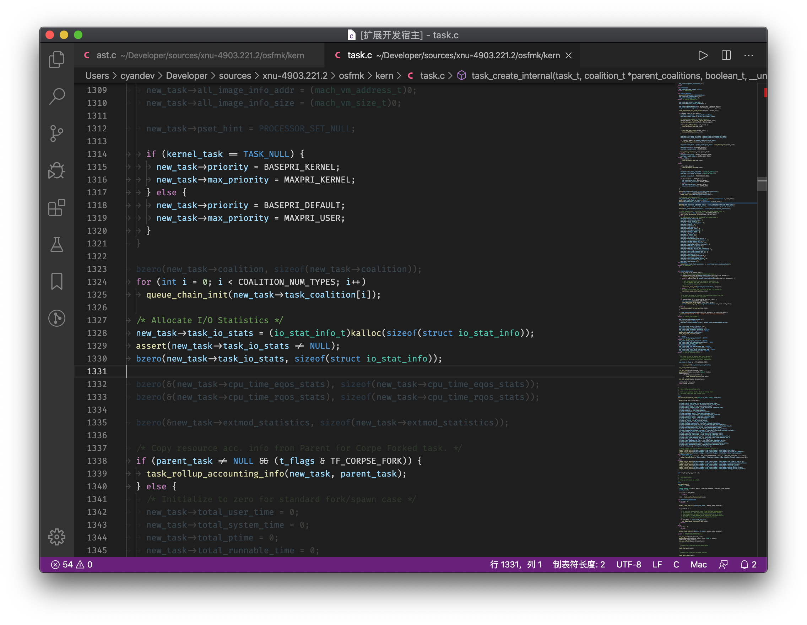

# vscode-spotlight

> A spotlight that help you focus on some lines

## Overview

This extension let you dim the lines outside the selections. It can help your presentation or code reviewing process to be better.



## Features

* Multiple ranges highlighting supports
* Show the list of highlighted ranges
* Quick jump

## Usage

Open **Command Palette** and search for "Spotlight". There are the commands the extension provides:

* Change Opacity of Dimmed Text
* Clear Ranges
* Focus on the Selected Lines
* Show Highlighted Ranges

To highlight some lines, select these lines and execute "Focus on the Selected Lines" command.

## Configurations

```javascript
// The opacity of the lines outside the focus ranges.
"spotlight.dimOpacity": 0.4
```

## License
MIT
